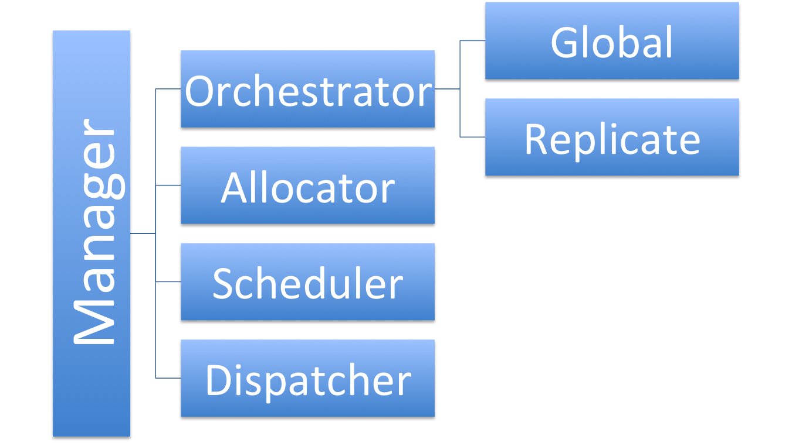

# SwarmKit的架构概览
=====================

[TOC]

## 概述
-------------
Swarmkit是一个分布式集群调度平台,它的默认调度单元是Docker容器，但其实也可以调用自定的task。作为docker一个新的集群调度开源项目，它借鉴了许多k8s和marthon的优秀理念，也被docker公司寄予了厚望，内嵌到了docker daemon中。

现在我们就来理解一下swarmd的基本概念模型：

### 核心概念

Cluster(集群)

一个 _cluster_ 由一组统一配置的的装有docker引擎的节点连接起来完成计算工作

Node（节点）

_Node_ 是集群的基本组成单元，其身份分为Manager和Agent

Manager(管理器)

_Manager_ 负责接收用户创建的 _Service_, 并且根据 service的定义创建一组task，根据task所需分配计算资源和选择运行节点，并且将task调度到指定的节点。而manager含有以下子模块：

Orchestrator(编排器)

Orchestrator负责确保每个service中的task按照service定义正确的运行

Allocator(全局资源分配器)

Allocator负责分配全局资源，比如overlay网络的ip地址和分布式存储，目前只是实现是vip地址分配

scheduler(调度器)

Scheduler负责将Service中定义的task调度到可用的Node上

Dispatcher（分发器）

Dispatcher直接处理与所有agent的连接， 这里包含agent的注册，session的管理以及每个task的部署和状态追踪。

global services

全局服务模式， 需要每个node上部署一个task实例，有点像k8s中的daemon set，用来部署向gluster等分布式存储和fluented日志搜集模块这种类型的基础服务

基本概念
-------------