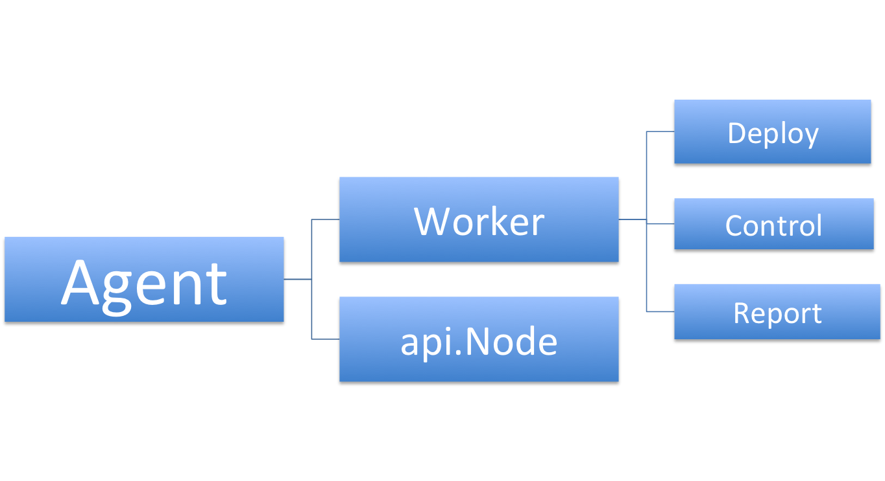
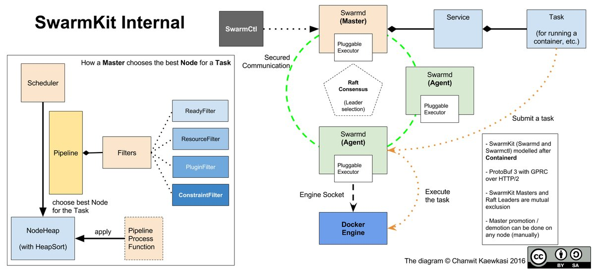

# SwarmKit的架构概览
=====================

[TOC]

## 概述
-------------
Swarmkit是一个分布式集群调度平台,它的默认调度单元是Docker容器，但其实也可以调用自定的task。作为docker一个新的集群调度开源项目，它借鉴了许多k8s和marthon的优秀理念，也被docker公司寄予了厚望，内嵌到了docker daemon中。

现在我们就来理解一下swarmd的基本概念模型和架构简介：

### 概念模型

#### Service(服务)

一个service包含完成同一项工作的一组Task，它分为

Golbal(全局服务模式)， 需要每个node上部署一个task实例，有点像k8s中的daemon set，用来部署向gluster等分布式存储和fluented日志搜集模块这种类型的基础服务  

Replicated(重复服务模式)， 需要按照最终用户指定的数量尽可能在不同的节点上部署task的实例

#### Task(任务)

作为Swarmkit中的基本调度单元， Task承担了创建docker容器，并且运行指定命令的责任（docker run）。实际上在未来，task的工作可以更灵活和插件化。

### 架构综述

#### Cluster(集群)

一个 _cluster_ 由一组统一配置的的装有docker引擎的节点连接起来完成计算工作

#### Node(节点）

_Node_ 是集群的基本组成单元，其身份分为Manager和Worker

#### Manager(管理器)

_Manager_ 负责接收用户创建的 _Service_, 并且根据 service的定义创建一组task，根据task所需分配计算资源和选择运行节点，并且将task调度到指定的节点。而manager含有以下子模块：

```go
type Manager struct {
	...
	Dispatcher             *dispatcher.Dispatcher
	replicatedOrchestrator *orchestrator.ReplicatedOrchestrator
	globalOrchestrator     *orchestrator.GlobalOrchestrator
	taskReaper             *orchestrator.TaskReaper
	scheduler              *scheduler.Scheduler
	allocator              *allocator.Allocator
	...
}
```

##### Orchestrator(编排器)

Orchestrator负责确保每个service中的task按照service定义正确的运行

##### Allocator(资源分配器)

Allocator主要负责分配资源，而这种资源通常为全局的，比如overlay网络的ip地址和分布式存储，目前只是实现是vip地址分配。未来一些自定义资源也可以通过Allocator来分配。

##### scheduler(调度器)

Scheduler负责将Service中定义的task调度到可用的Node上

##### Dispatcher(分发器）

Dispatcher直接处理与所有agent的连接， 这里包含agent的注册，session的管理以及每个task的部署和状态追踪。


除此之外，Swarmkit基于Raft算法在内存中维护集群的状态一致性，在一组Manager选出一个Leader。只有Leader处理所有的请求，其它的Manager只是把请求传给leader,起到了反向代理的作用。

#### Agent

_Agent_ 负责管理Node，部署Task以及追踪Task的状态，并且将Task的状态汇报给Manager。Agent包含以下子模块:

```go
type Agent struct {
	...
	node *api.Node
	worker   Worker
	...
}
```

#### api.Node(节点状态)

_api.Node_ 负责向Manager定期汇报所在节点实际状态. 当一个节点的这实际状态和期望状态不一致时，Manager会自动将服务中的任务调度到其他节点，以保证服务的正常运行。


#### Worker(任务处理器）

_Worker_ 处理以下工作
* 部署和启动Task
* Task状态追踪和汇报
* 对于部署在本机上的task内容及状态的持久化, 




Swarmkit提供了两个可执行程序：swarmd和swarmctl。swarmd部署在cluster中的每一个node上，彼此间互相通信，组成cluster；而swarmctl则用来控制整个集群。 下图可以清楚地描述Swarmkit的内部机制(该图出自于https://pbs.twimg.com/media/Ckb8EMLVAAQrxYH.jpg)



**Notice** 该图中的GPRC应该为GRPC
